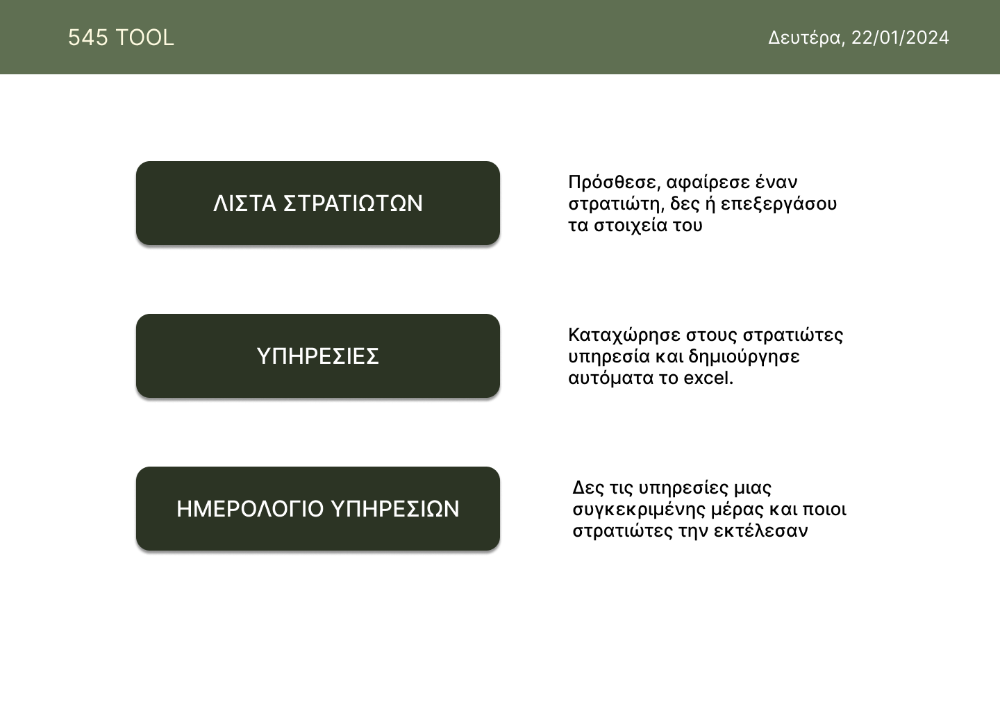
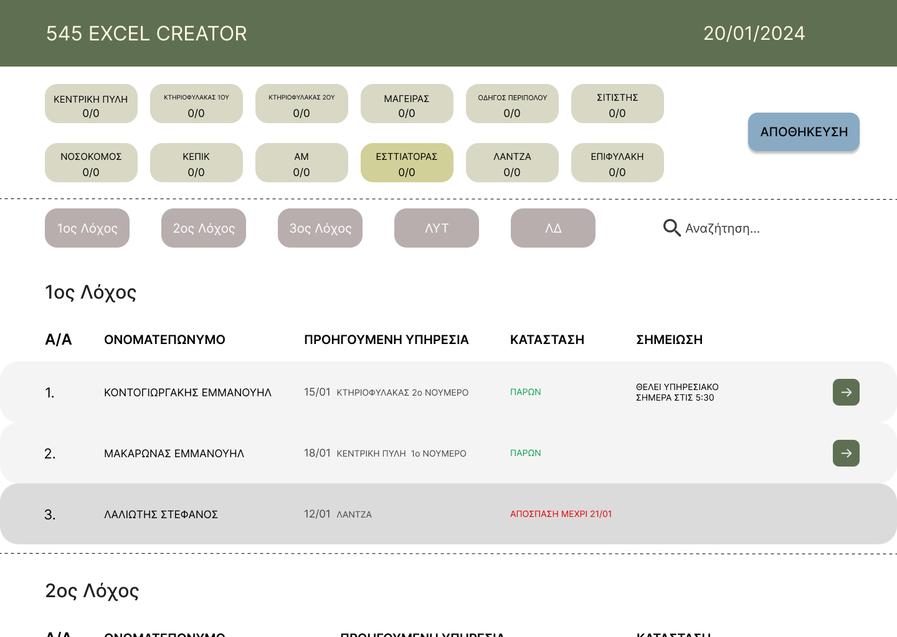
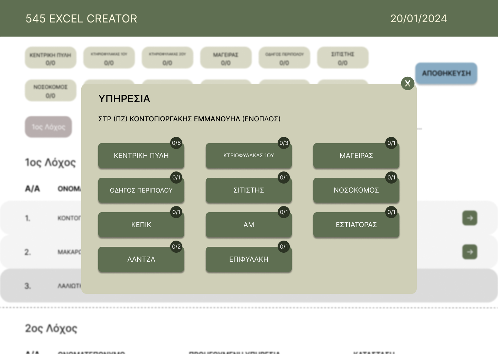
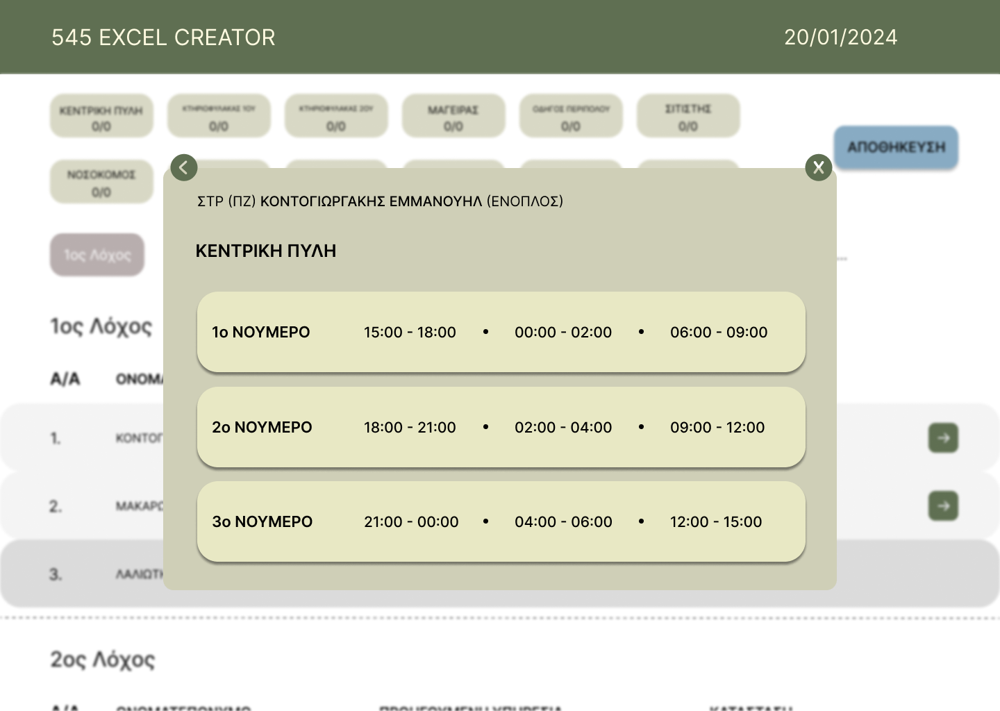
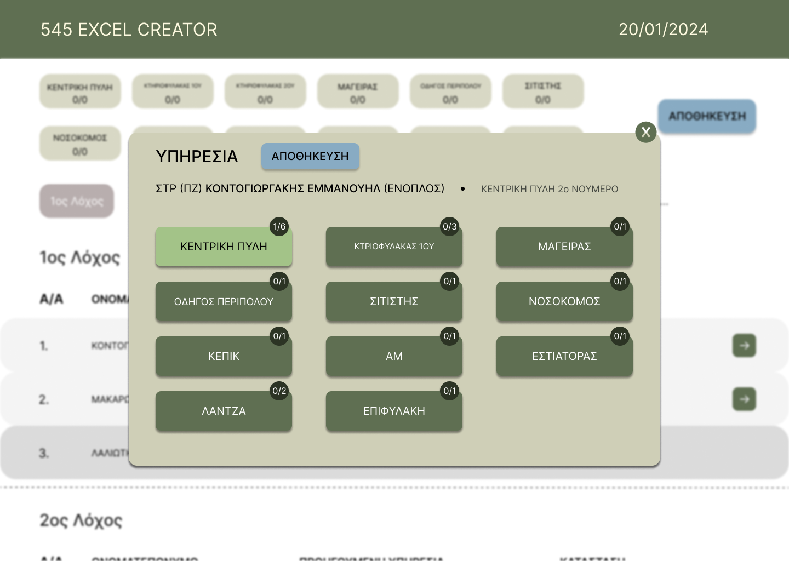
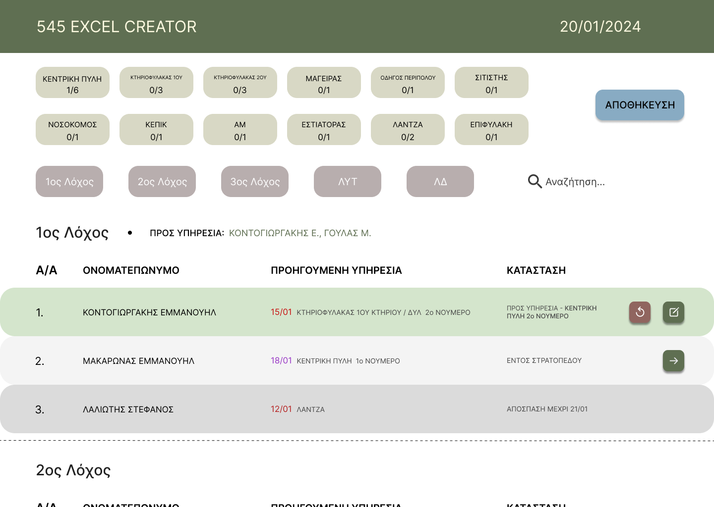

# Smart Helmet Application


An application designed for the systematic organization and optimization of military personnel management, streamlining the allocation of their duties and responsibilities. 

## Overview

The application serves as a comprehensive tool for efficiently managing service assignments within Unit 545. It streamlines the process of allocating tasks to soldiers by providing a user-friendly interface that allows for quick and targeted actions. With its focus on simplicity and effectiveness, the application empowers users to navigate through soldier lists, make necessary updates, and assign services effortlessly. 

## Key Features
* **Soldier Management**: Users can view, add, delete, and mark the availability of soldiers, as well as add personal notes.
* **Service Assignment**: Users can assign services to soldiers based on availability and armament status, adjusting service numbers as needed.
* **Excel Export**: The application generates an Excel file with the required format for service assignment, which remains editable for any necessary changes.
* **Service Log**: Users can refer back to previous days' services for reference, acting as a service log for historical data and tracking.

## Screenshots

|  |  
|:---:|:---:|
| Options | Duties |

|  |  
|:---:|:---:|
| Select Soldier | Central Gate select |

|  |  
|:---:|:---:|
| Apply Soldier | Applied |

|  
|:---:|
| Final file |


## Installation 

What you will need:
* NodeJS
* Angular
* MongoDB

Tested on: 
* NodeJS v18.12.1
* Angular v14.2.8
* MongoDB v4.4

### Useful commands
Before running the application and after every new node_module is installed using `npm install @package-name`, all project members must execute in both *`backend`* and *`frontend`*:
```sh
npm install
``` 

For frontend, inside *`frontend`* folder:

> Run frontend:
```sh
ng serve
```

> Run frontend (open access from other devices using server's IP):
```sh
ng serve --host 0.0.0.0
```

For backend, inside *`backend`* folder:
> Run backend:
```sh
npm run dev
```

**Do not forget**: mongod.exe (if on Windows) must be running for the Database to be used. 

